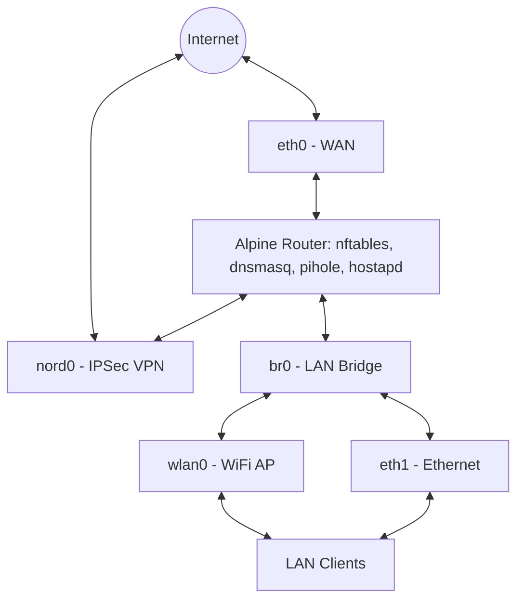

## Requirements

You will need:

- An Alpine Linux system with at least 2 network interfaces (WAN + LAN)
- Basic familiarity with the Linux command line
- Root or sudo/doas access

Optional components used in this guide:

- Wireless access point (hostapd)
- VPN routing (strongSwan)
- DNS/DHCP via dnsmasq or Pi-hole

## Network Layout

This setup uses a single WAN interface (`eth0`) connected to the internet, and a LAN bridge (`br0`) that combines an Ethernet interface (`eth1`) and a wireless interface (`wlan0`).

Devices can connect to the LAN either through Ethernet (via a switch) or Wi-Fi. The router provides services such as DHCP, DNS, and optional VPN routing.

Traffic can either go directly to the internet or be routed through a VPN (`nord0`) depending on firewall and routing rules.



> **Note:**
> Interface names and topology may differ depending on your hardware.
> Replace interface names (e.g., `eth0`, `eth1`, `wlan0`) with those used on your system.  
> You can list your interfaces with: `ip link`

## Configuration Values


lan_gateway_ip        | LAN Gateway IP (br0 address) | 192.168.2.1
lan_subnet            | LAN Subnet (br0 subnet)      | 192.168.2.0/24
gateway_hostname      | Gateway Hostname
lan_gateway_ipv6      | LAN Gateway IPv6 (ULA, br0)  | fd42:6c61:6e00:1::1
xfrm_id               | XFRM Interface ID (nord0)    | 42
lan_ipv6_prefix       | LAN IPv6 Prefix              | fd42:6c61:6e00:1::
nord_service_username | Nordvpn Service Username
nord_service_password | Nordvpn Service Password
nord_hostname         | Nordvpn Hostname             | us5783.nordvpn.com
nord_ip               | Nordvpn IP                   | 84.17.45.205


## Initial Network Setup
This section sets up basic routing, network interfaces, and NAT so your system can function as a router.

### Enable IP Forwarding

Check if IP forwarding is enabled:
```console
$ cat /proc/sys/net/ipv4/ip_forward
```

- 1 → enabled
- 0 → disabled

To enable it permanently, edit `/etc/sysctl.conf` and add or uncomment the following:
```
net.ipv4.ip_forward = 1
```

Apply the changes:
```
doas sysctl -p
```

### Configure Network Interfaces

Edit the `/etc/network/interfaces` file with the following configuration


# WAN — DHCP from ISP
auto eth0
iface eth0 inet dhcp
 
# Bridge for LAN (Wired + WiFi)
auto br0
iface br0 inet static
    address [[lan_gateway_ip]]/24
    bridge_ports eth1 wlan0
    bridge_stp off
    bridge_fd 0
    # Disable accepting IPv6 Router Advertisements on br0
    post-up sysctl -w net.ipv6.conf.br0.accept_ra=0
 
# Assign IPv6 ULA address to bridge
iface br0 inet6 static
    address [[lan_gateway_ipv6]]/64
 
# Bridge members — managed by br0, no individual addressing
iface eth1 inet manual
iface wlan0 inet manual
 
# nord0 — xfrm interface for StrongSwan
auto nord0
iface nord0
    requires eth0
    # Create the xfrm link before bringing the interface up
    pre-up  ip link add nord0 type xfrm dev eth0 if_id [[xfrm_id]]
    post-up ip link set nord0 up
    # Tear it down cleanly on ifdown
    post-down ip link set nord0 down
    post-down ip link del nord0


Notes on Configuration:
- `eth1` and `wlan0` are attached to `br0`, allowing LAN clients to connect via Ethernet or Wi-Fi.
- IPv6 router advertisements are disabled on `br0` (not sysctl.conf) to prevent it from auto-configuring itself via SLAAC.

This is necessary because:
1. The kernel starts
2. `/etc/sysctl.conf` is applied
3. Networking starts
4. `br0` is created
5. Default IPv6 behavior is applied `accept_ra = 1`

Since br0 does not exist when sysctl runs, we override it using post-up.
- nord0 is an XFRM interface used by strongSwan for IPSec/VPN routing.

Restart Networking:
```console
$ doas rc-service networking restart
```

### Set Up Filtering and NAT with nftables

Install nftables (if not already installed):
```console
$ apk add nftables
```

Create `/etc/nftables.d/filter.nft` with the following rules.


#!/usr/sbin/nft -f
# /etc/nftables.d/router.nft
#
# Adjust interface names to match your setup:
#   LAN interface (clients connect here): eth1, lan, br0, etc.
#   WAN interface (upstream/internet):    eth0, wan, etc.

# Router forwarding rules.
# The base config has "chain forward { policy drop; }" which blocks ALL
# routed traffic between interfaces. These rules open it up appropriately.
table inet filter {
    define LAN_IFACES = { "br0" }
    #define WAN_IFACES = { "eth0", "nord0" }
    define LOCAL_SUBNETS_IPV6 = { [[lan_ipv6_prefix]]/64 }

    #counter all_traffic {
    #    comment "WAN total traffic counter"
    #}

    set local_subnets {
        type ipv4_addr
        flags interval
        elements = {
            [[lan_subnet]],
        }
    }

    chain forward {
        # Allow established/related traffic (return traffic) in both directions (stateful)
        ct state { established, related } accept \
        comment "Allow established forwarded flows"

        ct state invalid drop \
        comment "Drop invalid forwarded packets"

        # Currently use ULA addresses which are not routable to internet
        meta nfproto ipv6 drop comment "Block IPv6 forwarding"
        # Block ULA's (Unique Local Address)
        #ip6 saddr fd00::/8 drop comment "Block IPv6 ULAs"

        # Allow LAN -> WAN (clients going to internet)
        # Replace interface names as needed.
        iifname $LAN_IFACES oifname "eth0" accept \
        comment "Allow LAN to WAN forwarding"

        # Allow LAN -> VPN
        #iifname $LAN_IFACES oifname "nord0" accept \
        #comment "Allow LAN to NordVPN forwarding"

        # Optional: Allow WAN -> LAN for specific port forwards.
        # This can be more specific such as specific ip
        # iifname "eth0" oifname $LAN_IFACES ct state { new } tcp dport 22 accept

        # Allow WAN -> LAN for all port forwards (dnat).
        #ct status dnat accept comment "Accept all port forwards"
    }

    # Open ports for self-hosted services on the router.
    # (e.g. if you run a DNS, OpenSSH, web, or VPN server on the router itself)
    chain input {
        # DNS server on the router (e.g. dnsmasq, pihole, Unbound)
        iifname $LAN_IFACES udp dport 53 accept \
        comment "Allow LAN DNS queries to router"
        iifname $LAN_IFACES tcp dport 53 accept \
        comment "Allow LAN DNS TCP queries to router"

        # DHCP server on the router
        iifname $LAN_IFACES udp dport 67 accept \
        comment "Allow DHCP from LAN clients"

        # Allow Pi-hole Web UI from LAN
        #ip saddr @local_subnets tcp dport 80 accept \
        #comment "Allow LAN access to Pi-hole admin"
        #ip6 saddr $LOCAL_SUBNETS_IPV6 tcp dport 80 accept

        # Allow SSH from trusted subnets.
        # Add or remove subnets to match your environment.
        ip saddr @local_subnets tcp dport 22 accept \
        comment "Allow SSH from trusted subnets"
        ip6 saddr $LOCAL_SUBNETS_IPV6 tcp dport 22 accept

        # Limit SSH to 10 simultaneous connections per source IP
        #tcp dport 22 ct count over 10 drop

        # ICMP rate limiting (ping flood protection)
        #ip protocol icmp icmp type echo-request \
        #limit rate over 10/second \
        #drop \
        #comment "Rate limit incoming pings"

        # Uncomment below to also allow SSH from a specific single host:
        # ip saddr 203.0.113.5 tcp dport 22 accept \
        # comment "Allow SSH from my remote IP"

        # Block specific IPs or ranges (blocklist)
        #ip saddr {
        #    198.51.100.0/24,
        #    203.0.113.0/24,
        #} drop \
        #comment "Drop traffic from blocked IP ranges"

        # SSH Brute-Force Rate Limiting
        # Allow max 5 new SSH connections per minute per source IP.
        # Log dropped ssh connections. Logs show up in dmesg or /var/log/messages
        #tcp dport 22 ct state new \
        #limit rate over 5/minute \
        #log prefix "[nft drop ssh] " flags all \
        #drop \
        #comment "Rate limit SSH to prevent brute force"

        # WireGuard VPN endpoint on the router
        #udp dport 51820 accept \
        #comment "Allow WireGuard VPN connections"

        # ICMP rate limiting (ping flood protection)
        #ip protocol icmp icmp type echo-request \
        #limit rate over 10/second drop \
        #comment "Rate limit incoming pings"
    }

    #chain postrouting {
    #    type filter hook postrouting priority 0; policy accept;

        # counter for all traffic (keeps track of packets and number of bytes)
    #    oifname $WAN_IFACES counter name all_traffic
    #}
}


Create `/etc/nftables.d/nat.nft` with the following rules.

> **Note:** There is configuration in the ``nat.nft`` file that is ment for the following sections


#!/usr/sbin/nft -f
# /etc/nftables.d/nat.nft
# Replace "eth0" with your actual WAN (upstream/internet-facing) interface name.

table inet nat {
    chain nordvpn_snat {
        # empty by default. An snat rule is added here by the nordvpn-route init script
    }

    # Port Forwarding (DNAT)
    chain prerouting {
        # priority dstnat = -100
        type nat hook prerouting priority dstnat; policy accept;

        # NOTE: for these port forwards, make sure to allow the forwards
        # in the base chain 'type filter hook forward'. (filter.nft)

        # Forward WAN port 8080 -> internal web server at 192.168.1.100:80
        #iifname "eth0" tcp dport 8080 dnat ip to 192.168.1.100:80 \
        #comment "Port forward: WAN:8080 -> LAN web server"

        # Forward WAN port 2222 -> internal SSH server at 192.168.1.50:22
        #iifname "eth0" tcp dport 2222 dnat ip to 192.168.1.50:22 \
        #comment "Port forward: WAN:2222 -> LAN SSH server"
    }

    # NAT masquerade and snat for vpn ip
    chain postrouting {
        type nat hook postrouting priority srcnat; policy accept;

        # Masquerade all traffic leaving via the WAN interface.
        # This rewrites the source IP to the WAN IP, enabling NAT routing.
        oifname "eth0" masquerade

        # Change source address to address vpn expects
        # You do not need to uncomment this. This ip is already added through a vpn startup script (nordvpn-init)
        #oifname "nord0" snat ip to 10.6.0.X

        # Custom rules are added in the nordvpn_snat chain
        oifname "nord0" jump nordvpn_snat
    }
}


Ensure the nft files are included in `/etc/nftables.nft`

You can add, edit, or remove whatever you want/need from the nftable files.

The following link from the nftables wiki has a nice diagram that shows how packets traverse different hooks (prerouting, input, forward, postrouting, etc.). I suggest using it as a reference when adding or making changes to the nftables files.
- https://wiki.nftables.org/wiki-nftables/index.php/Netfilter_hooks

Then start nftables:
```console
$ doas rc-service nftables start
```

verify by running the following command. If you see your ruleset as output, then it worked. If there no output, it likely failed.
```console
$ doas nft list ruleset
```

Enable nftables boot:
```console
$ doas rc-update add nftables
```

Test Connectivity From a client device connected to the LAN:
```console
$ ping -4c 3 8.8.8.8
```

If this works, your router is successfully forwarding traffic to the internet.

## DHCP and DNS

> **Note:** Only run one DHCP server on your network at a time.

Your router needs to provide:
- DHCP → assigns IP addresses to clients
- DNS → resolves domain names

There are two main approaches:
- dnsmasq → lightweight, simple, CLI-based
- Pi-hole → feature-rich, web UI, ad-blocking

You can also combine both.

Choose Your Setup
- Option A: dnsmasq (simple, lightweight)
- Option B: Pi-hole (UI + ad blocking)
- Option C: Hybrid (dnsmasq for DHCP + local DNS, Pi-hole upstream)

### Option A: dnsmasq (Recommended for simplicity)

Install dnsmasq:
```console
$ apk add dnsmasq
```

#### Configure dnsmasq

Create the `/etc/dnsmasq.d/dnsmasq.conf` file with the following configuration:


# Listen only on the LAN interface
interface=br0
# Force dnsmasq to bind only to the specified interfaces
bind-interfaces

# DHCP range: from .2 to .253, mask 24h leases
dhcp-range=192.168.X.2,192.168.X.253,255.255.255.0,24h

# Tell clients what router (gateway) to use
dhcp-option=option:router,192.168.X.1

# Short hostnames. can resolve hostnames without domain. (ping hostname)
dhcp-option=option:domain-search,lan

# resolve hostname and "router" to the gateway ip for LAN clients
#address=/[[gateway_hostname]].lan/[[lan_gateway_ip]]
address=/router.lan/[[lan_gateway_ip]]

# instructs dnsmasq to take full control of the network's IP address management, allowing it to immediately 
# re-assign IP addresses to clients, even if the server has no prior record of a previous lease.
# This avoids long timeouts when a machine wakes up on a new network, power cycles, or changes networks.
dhcp-authoritative
# Never forward plain names (without a dot or domain part)
domain-needed
# Prevents forwarding reverse ip lookups in the non-routed address spaces.
bogus-priv

# Static lease to a mac address and optional hostname to ip
#dhcp-host=00:00:00:00:00:00,192.168.X.X,HOSTNAME

# Tell clients to use this router for DNS
dhcp-option=option:dns-server,192.168.X.1
# Tell clients to use this router for DNS with IPV6
dhcp-option=option6:dns-server,[[[lan_gateway_ipv6]]]
# Add pi-hole as a name server to forward unresolved dns request to on another port
#server=127.0.0.1#5335

# IPv6 Router Advertisement
enable-ra
# Do Router Advertisements, BUT NOT DHCPv6 for this subnet.
# Clients configure with SLAAC and the specified prefix
dhcp-range=[[lan_ipv6_prefix]],ra-only


#### Local hostname resolution

> **Note:**
> dnsmasq reads the /etc/hosts and makes them resolvable to your LAN. If you haven't modified this file, it likely has default examples such as 127.0.0.1 for [[gateway_hostname]].my.domain from the first installation. This would resolve things such as the router hostname to localhost for clients which we don't want. I suggest removing the defaults and having something simple such as in the following step.

Edit `/etc/hosts` with the following config
```
127.0.0.1 localhost
::1       localhost
```

Keep this minimal to avoid incorrect resolution. You can also add domains to be resolved for clients and the router itself here.

#### (Optional) Make router use its own DNS

> **Note:**
> We prevent resolv.conf from being overwritten because when DHCP runs, it rewrites "/etc/resolv.conf" to use the DNS servers given by an upstream router. Making the file immutable prevents DHCP from rewriting resolv.conf.

Edit `/etc/resolv.conf` with the following config
```
nameserver 127.0.0.1
```

Prevent overwriting of `/etc/resolv.conf` by editing `/etc/udhcpc/udhcpc.conf` with the following
```
RESOLV_CONF="no"
```

Alternatively make `/etc/resolv.conf` immutability:
```console
$ chattr +i /etc/resolv.conf
```

Remove immutability when needed with:
```console
$ chattr -i /etc/resolv.conf
```

#### Start dnsmasq
```console
$ doas rc-service dnsmasq start
$ doas rc-update add dnsmasq
```

### Option B: Pi-hole

> **Note:** Pi-hole is available in Alpine’s edge/testing repositories at the time of this writting.

#### Install Pi-hole

If using edge:
```console
$ apk add pihole
```

If using stable edit `/etc/apk/repositories` and add the following text
```
@testing http://dl-cdn.alpinelinux.org/alpine/edge/testing
```

Then update the system packages and install pihole:
```console
$ apk update
$ apk add pihole@testing
```

#### Start Pi-hole

```console
$ doas rc-service pihole start
$ doas rc-update add pihole
```

#### Configure Pi-hole

> **Note:** If you change the pihole.toml file while pihole is not running and then start pihole, your changes will be reset.

You can use:
- Web UI (recommended)
- Or the `/etc/pihole/pihole.toml` config file

Example of changes made on pihole.toml:
```toml
[dns]
  upstreams = [
    "1.1.1.1",
    "8.8.8.8"
  ] # cloudflare and google dns servers
  interface = ""
[dhcp]
  active = true
  start = "192.168.X.2"
  end = "192.168.X.253"
  router = "192.168.X.1"
  netmask = "255.255.255.0"
  leaseTime = "24h"
  hosts = [
    "00:00:00:00:00:00,192.168.X.X,HOSTNAME"
  ] # Static DHCP leases to mac address (OPTIONAL)
```

#### Access pihole Web UI

To access the pi-hole webui, go into the `/etc/nftables.d/filter.nft` file and uncomment the rule
allowing pi-hole webui access from LAN, port 80

By default web url to pihole is at `http://<router-ip>/`

#### Set pihole webui password

```command
$ doas pihole setpassword
```

Remove password:
```command
$ doas pihole setpassword ""
```

### Option C: Hybrid (dnsmasq + Pi-hole)

This is the most flexible setup:
- dnsmasq → DHCP + local hostname resolution
- Pi-hole → upstream DNS + ad blocking

#### Configure Pi-hole

First, follow the steps in [Option B](#option-b-pi-hole) to install and setup pihole.

Then simply configure pihole with the following options
```toml
[dhcp]
active = false
port = 5335
```

#### Configure dnsmasq

First, follow the steps in [Option A](#option-a-dnsmasq-recommended-for-simplicity) to install and setup pihole.

Then simply uncomment the following line in `/etc/dnsmasq.d/dnsmasq.conf`
```
server=127.0.0.1#5335
```

#### How it works

1. Clients → query dnsmasq
2. dnsmasq → resolves local names (e.g., `router.lan`)
3. Unresolved queries → forwarded to Pi-hole
4. Pi-hole → filters + resolves upstream

## Routing Traffic Through NordVPN (IPSec + strongSwan)

This section shows how to route selected traffic through NordVPN using IKEv2/IPSec with strongSwan.

Instead of sending all traffic through the VPN, this setup allows you to selectively route traffic using packet marking and custom routing tables.

### Overview

- `strongSwan` → establishes the VPN tunnel
- `nord0` → XFRM interface used for VPN traffic
- `nftables` → marks packets for VPN routing
- `iproute2` → routes marked packets through a custom table

### Get NordVPN Service Credentials

{}
⚠️ These are NOT your normal Nord account credentials.
{}

Steps:
1. Log into your Nord account
2. Go to NordVPN → Set up manually
3. Open Service credentials
4. Verify your email

Save:
- Username → [[nord_service_username]]
- Password → [[nord_service_password]]

These are used for EAP-MSCHAPv2 authentication

### Install NordVPN CA Certificate
```console
$ wget https://downloads.nordcdn.com/certificates/root.pem \
$     -O /etc/ipsec.d/cacerts/NordVPN.pem
```

### Choose a NordVPN Server

From the Nord dashboard:

1. Go to Server recommendation
2. Select IKEv2/IPSec
3. Copy hostname (example: `us5783.nordvpn.com`)

Resolve it:

dig +short [[nord_hostname]]


Save:
- Hostname → [[nord_hostname]]
- IP → [[nord_ip]]

### Create a Routing Table

Create a custom routing table for VPN traffic:
```console
$ mkdir -p /etc/iproute2
$ echo "200 nordvpn" | sudo tee -a /etc/iproute2/rt_tables
```

### Configure strongSwan

Install strongSwan:
```console
$ apk add strongswan
```

Create the `/etc/swanctl/conf.d/swanctl.conf` file with the following configuration


connections {
  nordvpn {
    version = 2
    remote_addrs = [[nord_ip]]

    proposals = aes256-sha256-modp2048

    local {
      auth = eap-mschapv2
      eap_id = [[nord_service_username]]
    }

    remote {
      auth = pubkey
      id = [[nord_hostname]]
    }

    vips = 0.0.0.0

    children {
      net {
        local_ts  = 0.0.0.0/0
        remote_ts = 0.0.0.0/0
        esp_proposals = aes256-sha256

        if_id_in  = [[xfrm_id]]
        if_id_out = [[xfrm_id]]

	start_action = start
	dpd_action   = restart
	close_action = start
      }
    }
  }
}

secrets {
  eap-nord {
    id = [[nord_service_username]]
    secret = [[nord_service_password]]
  }
}


### Create nordvpn-route init script

Create an openrc script at `/usr/local/etc/init.d/nordvpn-route` with the following script.


#!/sbin/openrc-run
description="NordVPN Routing and SNAT Setup"

depend() {
    need strongswan
    need nftables
}

start() {
    ebegin "Starting NordVPN routing"

    # Wait for charon's VICI socket to be ready before talking to it
    local i
    for i in $(seq 1 15); do
        if [ -S /run/charon.vici ] || [ -S /var/run/charon.vici ]; then
            break
        fi
        sleep 1
    done

    if [ ! -S /run/charon.vici ] && [ ! -S /var/run/charon.vici ]; then
        eerror "charon VICI socket never appeared, strongSwan may not be running"
        eend 1
        return 1
    fi

    # Ensure swanctl config is loaded and connection is initiated.
    # Alpine's strongswan init script may not call --load-all automatically,
    # so we do it here explicitly. This is safe to call even if already loaded.
    swanctl --load-all >/dev/null 2>&1

    # Wait up to 40 seconds for the CHILD_SA to reach INSTALLED state.
    local i
    for i in $(seq 1 40); do
        if swanctl --list-sas 2>/dev/null | grep -q "INSTALLED"; then
            break
        fi
        sleep 1
    done

    if ! swanctl --list-sas 2>/dev/null | grep -q "INSTALLED"; then
        eerror "NordVPN tunnel was not established after 40 seconds"
        eend 1
        return 1
    fi

    # Extract the virtual IP NordVPN assigned us from the established SA.
    local VPN_IP
    VPN_IP=$(swanctl --list-sas | awk '/local  [0-9]+\.[0-9]+\.[0-9]+\.[0-9]+\/32/ {print $2}' | cut -d/ -f1)

    if [ -z "$VPN_IP" ]; then
        eerror "Could not determine NordVPN virtual IP from established SA"
        eend 1
        return 1
    fi

    einfo "Using VPN IP: $VPN_IP"

    # Add policy routing: packets marked 0x1 go through the nordvpn table.
    ip rule add fwmark 0x1 table nordvpn 2>/dev/null || true
    # Add nord0 as the default route in the nordvpn table.
    ip route add default dev nord0 table nordvpn 2>/dev/null || true

    # Flush the SNAT chain and install the rule using the actual VPN VIP.
    nft flush chain inet nat nordvpn_snat
    nft add rule inet nat nordvpn_snat snat ip to "$VPN_IP"

    eend $?
}

stop() {
    ebegin "Removing NordVPN routing"
    ip rule del fwmark 0x1 table nordvpn 2>/dev/null || true
    ip route flush table nordvpn 2>/dev/null || true
    nft flush chain inet nat nordvpn_snat
    eend $?
}


The `nordvpn-route` script:
- Waits for strongSwans charon's VICI socket to be ready
- Ensures swanctl config is loaded and connection is initiated
- Extracts the virtual IP NordVPN assigned us
- Adds a routing rule to route marked traffic through the nordvpn table
- Adds an nftable rule on the `nat` table, `nordvpn_snat` chain that changes the source address (`snat`) to the extracted vpn ip.

### Configure Routing + nftables

#### nftables (packet marking)

Create the `/etc/nftables.d/mangle.nft` file with the following rules.


#!/usr/sbin/nft -f
# Marking Packets that will be sent through an interface to nordvpn

# priority mangle = -150
table inet mangle {
    define VPN_EXCLUDE_LIST_IPV6 = { [[lan_ipv6_prefix]]/64 }

    set vpn_exclude_list {
        type ipv4_addr
        flags interval
        elements = {
            # Do not mark packets going to local networks
            [[lan_subnet]],
            # Do not mark packets going to nord server itself
            [[nord_ip]]
        }
    }

    # Marking Received Packets that will be sent through XFRM interface to nordvpn
    # Note: priority mangle in prerouting runs before conntrack (ct) can rewrite destination ip (dnat).
    chain prerouting {
        type filter hook prerouting priority 0; policy accept;
        # Do not mark return packets
        ct direction reply return

        ip daddr @vpn_exclude_list return
        ip6 daddr $VPN_EXCLUDE_LIST_IPV6 return

        # Mark packets from a specific address (replace with what you want)
        ip saddr 192.168.100.139 mark set 0x1 \
        comment "Route IPs through NordVPN"

        # Match by MAC - useful for devices with dynamic IPs (phones, etc.)
        #ether saddr aa:bb:cc:dd:ee:ff mark set 0x1

        # Route only specific destination ports through VPN. Regardless of source
        #tcp dport 6881-6889 mark set 0x1
        #udp dport 6881-6889 mark set 0x1

        # Route traffic to a specific remote subnet through VPN
        # (e.g. a known CDN range, or a manually-looked-up streaming service)
        #ip daddr 23.246.0.0/18 mark set 0x1
    }

    # Marking Local Packets that will be sent through XFRM interface to nordvpn
    chain output {
        type route hook output priority mangle; policy accept;
        ip daddr @vpn_exclude_list return
        ip6 daddr $VPN_EXCLUDE_LIST_IPV6 return

        # Mark all local packets (packets orginating from this server)
        #mark set 0x1 comment "Route Local Traffic through NordVPN"
    }
}


#### Enable vpn services

```console
$ doas rc-update add strongswan
$ doas rc-update add nordvpn-route
```

Reboot and the vpn should automatically connect

#### Verify Connection

Check tunnel:
```console
$ doas swanctl --list-sas
```

Check routing decision on a marked packet:
```console
$ ip route get 8.8.8.8 mark 0x1
```

### Useful Commands

Terminate vpn connection:
```console
$ swanctl --terminate --ike nordvpn
```

Reconnect to the vpn:
```console
$ sudo swanctl --load-all
$ sudo swanctl --initiate --child net
```

## Setting Up a Wireless Access Point

This section configures your router to act as a Wi-Fi access point using `wlan0`, bridged into your LAN (`br0`).

Clients connecting over Wi-Fi will behave the same as wired LAN clients.

### Wi-Fi hardware support

Not all Wi-Fi adapters support access point (AP) mode.

Check with (may need to install iw first):
```console
$ iw list | grep -A 10 "Supported interface modes"
```

Look for:
```
* AP
```

### Configure hostapd

Install hostapd
```console
$ apk add hostapd
```

Open the `/etc/hostapd/hostapd.conf` file and update the following rules. I have some notes about what each config option does.

```ini
# Wifi interface device to use as an access point
interface=wlan0
# Bridge interface that connects both eth1 and wlan0
bridge=br0
# nl80211 is used with all modern Linux mac80211 drivers.
driver=nl80211
# Network Name
ssid=YourSSIDHere
# a = 802.11a (5GHz), g = 802.11g (2.4GHz)
hw_mode=g
# 1–13 for 2.4GHz, 36-165 for 5GHz
channel=6
# OR acs_survey = Automatic Channel Selection with ACS survey based algorithm. Use this instead if it's supported
#channel=acs_survey
# enables Quality of Service (QoS) features, ensuring, for instance, that a video call gets priority over a file download. 0 = disable
wmm_enabled=1
# authentication algorithms, 1 = WPA/WPA2/WPA3
auth_algs=1
# Send empty SSID in beacons and ignore probe request frames that do not specify full SSID, i.e., require stations to know SSID. 0=disabled
ignore_broadcast_ssid=0
# wpa auth (Wi-Fi Protected Access) 0=None, 1=WPA, 2=WPA2, 3=WPA3
## When using WPA/WPA2, a passphrase is required (wpa_passphrase)
wpa=2
# The wifi ASCII password
wpa_passphrase=YourSecurePassphrase
# key management algorithms (authentication method)
# WPA-PSK = WPA-Personal / WPA2-Personal
wpa_key_mgmt=WPA-PSK
# encryption method clients must use to encrypt traffic
# WPA2=CCMP, WPA3=GCMP
rsn_pairwise=CCMP
```

Enable and Start hostapd
```console
$ sudo rc-service hostapd start
$ sudo rc-update add hostapd
```

Verify
```console
$ ip addr
```

You should see:
- wlan0 active
- part of bridge br0

Then try connecting from a device using your SSID (Network Name).

### Important Notes

#### Channel selection

- 2.4GHz (hw_mode=g): channels 1–11 (US)
- 5GHz (hw_mode=a): channels vary

You can also use automatic selection (if supported):
```
channel=acs_survey
```

#### WPA2 vs WPA3

This guide uses WPA2 for compatibility.
- Works on nearly all devices
- More reliable across hardware

You can upgrade to WPA3 later if your hardware supports it.

#### Bridge behavior

Because wlan0 is attached to br0:
- Wi-Fi clients receive DHCP from your configured server
- They are on the same subnet as Ethernet clients
- No additional routing is needed

## Final Notes

At this point, your Alpine Linux system should be functioning as:

- A router (IPv4 NAT + forwarding)
- A DHCP/DNS server
- A wireless access point
- (Optional) A VPN gateway

You can now expand this setup with:

- Port forwarding
- Firewall rules
- VLANs
- Monitoring and logging

## Further Reading
- [Alpine Linux Home Router Guide](https://wiki.alpinelinux.org/wiki/Setting_up_a_Home_Router)
- [Alpine Linux Wireless Access Point Guide](https://wiki.alpinelinux.org/wiki/How_to_setup_a_wireless_access_point)
